# 🥘 PantryPilot — a privacy-first kitchen concierge

**Track: Concierge Agents** · Kaggle AI Agents: Intensive Vibe Coding Capstone

PantryPilot is a multi-agent personal assistant that answers three questions every household faces weekly:

1. *What do we actually have at home?*
2. *What should we cook this week — given our allergies, diet and budget?*
3. *What exactly do we need to buy, and at which store?*

## The problem

Meal planning is a recurring, unpaid coordination job. Doing it badly costs money (duplicate purchases, food waste) and can be dangerous: dietary restrictions and **allergies are health data**, and forgetting them in a plan has real consequences. Generic chatbot planning fails on both fronts — it doesn't know your pantry, and pasting your health information into a cloud service every week is a privacy anti-pattern.

## The solution

A team of specialized agents coordinated by an orchestrator, in which **the LLM never owns your data**. All personal state lives in a local SQLite database controlled by a custom MCP server ("PantryVault"). Agents can only interact with it through a narrow, validated, audited tool surface — and each agent only sees the tools it needs.

## Architecture

## Architecture


```mermaid
flowchart TB
    U["User"] <--> R
    subgraph ADK["Google ADK · Gemini"]
        R["pantry_concierge<br/><i>root orchestrator — no data tools</i>"]
        R -- delegate --> A["pantry_manager<br/><i>inventory CRUD</i>"]
        R -- delegate --> B["meal_planner<br/><i>weekly plans + preferences</i>"]
        R -- delegate --> C["shopping_assistant<br/><i>plan − pantry = list</i>"]
    end
    subgraph VAULT["PantryVault — custom MCP server (stdio, local)"]
        V["11 validated tools<br/>+ audit log"]
        DB[("SQLite<br/>pantry · preferences/allergies<br/>meal plans · shopping lists")]
        V --> DB
    end
    A -- "allowlist: 4 tools" --> V
    B -- "allowlist: 5 tools" --> V
    C -- "allowlist: 5 tools" --> V
```

**Why agents?** The workflow is genuinely multi-step and stateful: inventory changes daily, plans depend on preferences *and* inventory, shopping lists depend on plans *minus* inventory. Each specialist has a distinct instruction set and a distinct (minimal) tool permission set — a single prompt cannot enforce that separation; an agent architecture can.

## Security (Concierge track focus)

|Layer|Mechanism|Where|
|-|-|-|
|Data locality|All personal data in local SQLite; MCP over stdio — no ports, no network|`pantry\_mcp/server.py`|
|Least privilege|Per-agent MCP `tool\_filter` allowlists; root agent has **zero** data tools|`pantry\_concierge/agent.py`|
|Input validation|Type/length/bounds checks + closed key sets on every tool argument|`pantry\_mcp/server.py`|
|Injection safety|Parameterized SQL only; malformed JSON rejected before persistence|`pantry\_mcp/server.py`|
|PII redaction|`before\_model\_callback` strips emails/phones/IBANs from user input before any model call|`pantry\_concierge/callbacks.py`|
|Transparency|Audit log of every tool invocation (names + timestamps, never argument values), queryable by the user in chat|`pantry\_mcp/server.py`|

## Course concepts demonstrated

|Concept|Where|
|-|-|
|Multi-agent system (ADK)|1 orchestrator + 3 specialists, `sub\_agents` delegation — code|
|MCP server|Custom-built PantryVault server (FastMCP, stdio) — code|
|Security features|Table above — code + video|
|Antigravity|Generated + ran the validation test suite (55 tests) — video|
|Deployability|`adk web` locally; Cloud Run instructions below — video|

## Setup

```bash
git clone <this-repo> \&\& cd pantrypilot
python -m venv .venv \&\& source .venv/bin/activate   # Windows: .venv\\Scripts\\activate
pip install -r requirements.txt

cp pantry\_concierge/.env.example pantry\_concierge/.env
# edit .env and set GOOGLE\_API\_KEY (free: https://aistudio.google.com/apikey)

adk web        # open http://localhost:8000 and pick "pantry\_concierge"
```

No other services required — the MCP server is spawned automatically as a subprocess, and the database file is created on first use at `data/pantry.db`.

### Try this demo script

```
1. "I just bought 1kg couscous, 2 cans of chickpeas, 500g carrots and a bottle of olive oil"
2. "I'm allergic to peanuts, vegetarian on weekdays, budget 60 euros per week, I shop at Rewe and Colruyt"
3. "Plan my dinners for next week"        → uses pantry + respects allergies
4. "Save it and make my shopping list"    → plan minus pantry, grouped by store
5. "What did you do with my data?"        → agent reads back the audit log
```

### Deployment (optional)

The agent runs on Cloud Run via the ADK CLI:

```bash
adk deploy cloud\_run --project <PROJECT\_ID> --region europe-west1 pantry\_concierge
```

For a private, single-user deployment keep `--no-allow-unauthenticated` (default) so the endpoint requires IAM auth; the SQLite vault should then be placed on a mounted volume (`PANTRY\_DB=/mnt/data/pantry.db`).

## Repository layout

```
pantrypilot/
├── pantry\_concierge/        # ADK agent package
│   ├── agent.py             # orchestrator + 3 specialists, tool allowlists
│   ├── prompts.py           # all agent instructions in one reviewable place
│   ├── callbacks.py         # PII redaction before\_model\_callback
│   └── .env.example
├── pantry\_mcp/
│   └── server.py            # PantryVault MCP server (SQLite + validation + audit)
├── data/                    # created at runtime, gitignored
└── requirements.txt
```

## Limitations \& next steps

* Recipes come from the model's knowledge; a curated recipe MCP tool would make nutrition data exact.
* Store grouping is preference-based; live store inventory/price APIs are out of scope (and would leak shopping behavior — a deliberate trade-off for privacy).
* Multi-user households: per-member allergy profiles are a natural extension of the preferences schema.

